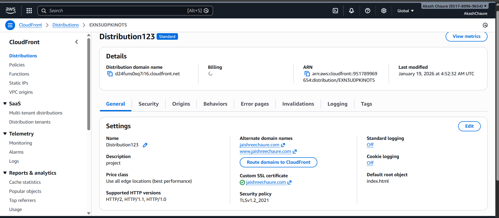
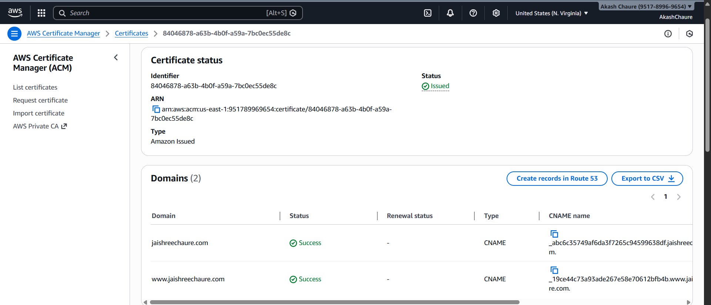
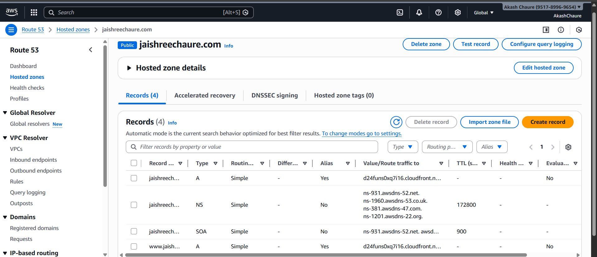
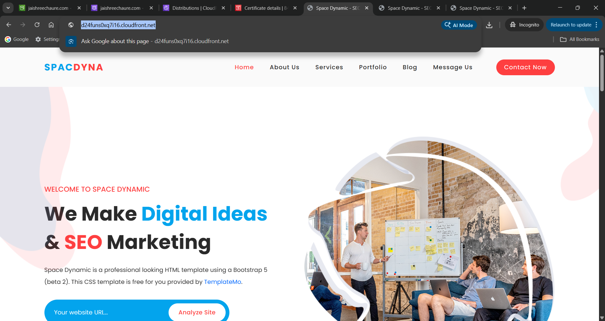
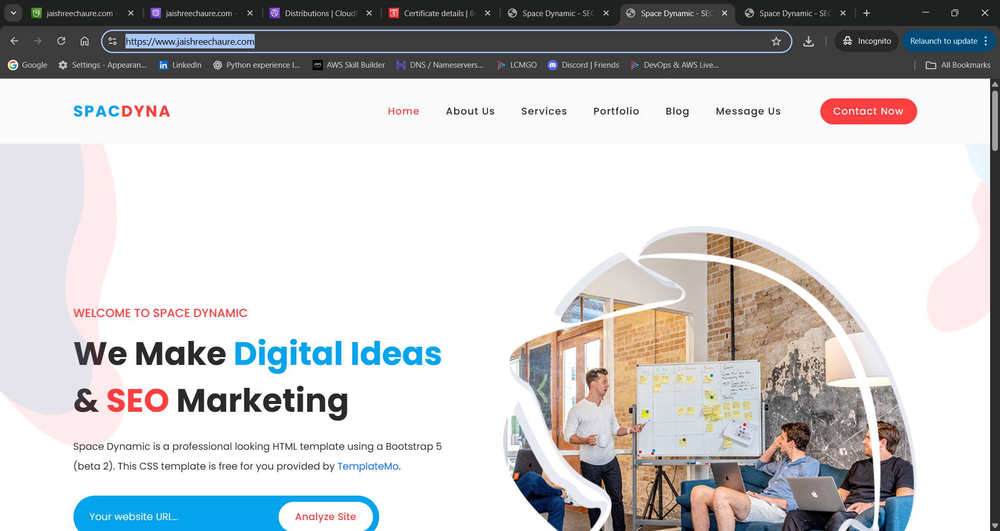

# AWS Static Website Hosting using Amazon S3 & CloudFront

## Project Overview
This project demonstrates how to design, deploy, and manage a secure, highly available, and globally distributed static website using core AWS services.  
The website is hosted on Amazon S3, delivered via Amazon CloudFront, secured with HTTPS using AWS Certificate Manager (ACM), and connected to a custom domain.

This project was created as a **hands-on AWS portfolio project** to gain real-world cloud deployment experience.

---

## Architecture
User Browser  
→ CloudFront (CDN + HTTPS)  
→ Amazon S3 (Static Website Files)

---

## AWS Services Used
- Amazon S3 – Static website hosting
- Amazon CloudFront – Global content delivery (CDN)
- AWS Certificate Manager (ACM) – SSL/TLS certificate
- IAM – Secure access management
- AWS CLI – Deployment and cache invalidation
- Git & GitHub – Version control and documentation

> **Note:** Domain DNS is managed using a third-party provider (Hostinger). Route 53 concepts were understood but not used directly in this deployment.

---

## Features
- Static website hosting on Amazon S3
- Global content delivery using CloudFront
- HTTPS enabled with ACM
- Custom domain and subdomain configuration
- CloudFront cache invalidation for updates
- Version-controlled source code using GitHub

---

## Implementation Steps
1. Created and configured an Amazon S3 bucket for static website hosting
2. Uploaded website files (HTML, CSS, assets)
3. Created a CloudFront distribution with S3 as origin
4. Requested SSL certificate using ACM (us-east-1)
5. Validated domain ownership via DNS
6. Attached SSL certificate to CloudFront
7. Configured custom domain DNS records
8. Deployed updates using AWS CLI
9. Managed project source code using Git & GitHub

---

## Live URLs
- CloudFront URL: https://d24funs0xq7i16.cloudfront.net  
- Custom Domain: https://jaishreechaure.com  
- Subdomain: https://www.jaishreechaure.com  

---

## Project Screenshots

### Architecture Diagram

### Amazon S3 Static Website Hosting

### Amazon S3 Bucket Objects

### CloudFront Distribution

### SSL Certificate (AWS Certificate Manager)

### Route 53 Hosted Zone (Learning Reference)

### Live Website (CloudFront URL)

### Live Website (Custom Domain)

---

## Learning Outcomes
- Practical understanding of static website hosting on AWS
- Hands-on experience with CDN, DNS, and SSL/TLS
- Real-world AWS deployment workflow
- Git-based version control and documentation
- Cloud cost awareness and resource cleanup practices

---

## Cost Optimization Note
To avoid unnecessary AWS charges, cloud resources for this project may be stopped or deleted when not actively in use.  
All architecture, deployment steps, and screenshots are documented in this repository.

---

## Author
**Jaishree Chaure**  
AWS Hands-on Portfolio Project
